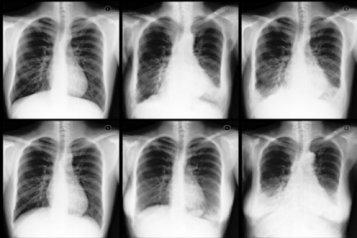
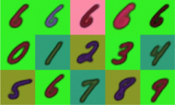

# Causal SSL

This work was presented at MICCAI 2024.

### Introduction
When citing this research, please use:
```
@inproceedings{ibrahim2024semisupervised,
  title={Semi-supervised learning for deep causal generative models},
  author={Ibrahim, Yasin and Warr, Hermione and Kamnitsas, Konstantinos},
  booktitle={International Conference on Medical Image Computing and Computer-Assisted Intervention},
  pages={294--303},
  year={2024},
  organization={Springer}
}
```
Ibrahim, Y., Warr, H. and Kamnitsas, K., 2024, October. Semi-supervised learning for deep causal generative models. In International Conference on Medical Image Computing and Computer-Assisted Intervention (pp. 294-303). Cham: Springer Nature Switzerland.

### Running Code
To install the required packages, run:
```
pip install -r requirements.txt
```

To train the generative model, navigate to the ```/src``` folder and run:
```
bash run_local.sh experiment_name
```

By default, this is set to use the coloured Morpho-MNIST data as described in the paper. To generate new semi-synthetic data with custom relationships between the variables, edit or create a new colour generator function in the ```colour_mnist.py``` file in the main directory, and then run:
```
python mnist.py [-h] [--size No. labelled samples] [--random Random labelling]
```
Currently, the variables available are:
 - Thickness
 - Intensity
 - Foreground (digit) colour
 - Background colour
 - Digit

Hyperparameters can be edited in the ```/src/hps.py``` file. These include:

- **labelled** : The proportion of data that is labelled (for MIMIC data)
- **random**: Whether to use random labelling 
- **seed**: Set random seed
- **scm_thresh**: When to start using predicted outputs
- **reg_thresh**: When to start counterfactual regularisation
- **rw**: Counterfactual regularisation weight
- **zrw**: Latent variable weight in counterfactual regularisation
- **beta**: KL penalty weight
- **cw**: Classifier weight

### Method Outline

 

### Example Outputs

 

### Acknowledgements
Code for the generative model is adapted from:
- [https://github.com/biomedia-mira/causal-gen](https://github.com/biomedia-mira/causal-gen)\
      De Sousa Ribeiro, F., Xia, T., Monteiro, M., Pawlowski, N., Glocker, B.: High Fidelity Image Counterfactuals with Probabilistic Causal Models. In: Proceedings of the 40th International Conference on Machine Learning. vol. 202, pp. 7390-7425 (2023)

Code for the custom MNIST data generation is based on:
- [https://github.com/dccastro/Morpho-MNIST](https://github.com/dccastro/Morpho-MNIST)\
      Castro, D. C., Tan, J., Kainz, B., Konukoglu, E., & Glocker, B. (2019). Morpho-MNIST: Quantitative Assessment and Diagnostics for Representation Learning. Journal of Machine Learning Research, 20(178).

- [https://github.com/salesforce/corr_based_prediction](https://github.com/salesforce/corr_based_prediction)\
      Arpit, D., Xiong, C. and Socher, R., 2019. Predicting with high correlation features. arXiv preprint arXiv:1910.00164.
